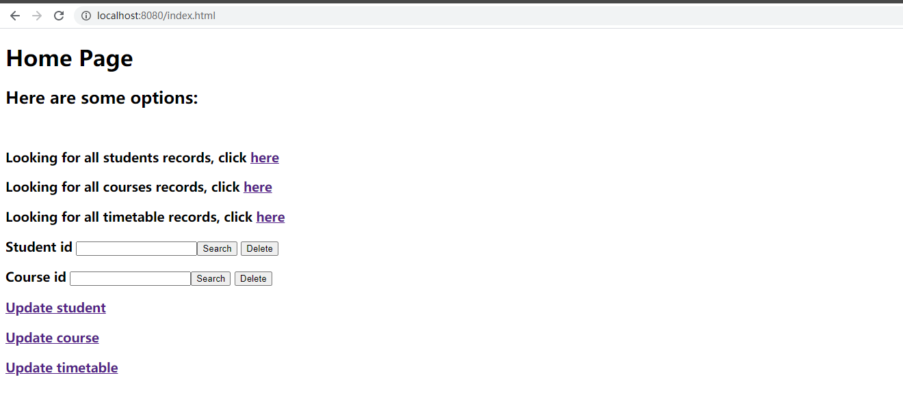

# Student/Course/Timetable records
Implemented RESTful api for _GET/POST/PUT/DELETE_ 4 web services, the passing data format is _JSON_ or _parameters_.         

_GET feature_ lets the user can search for a student who is taking what courses and its information by student Id, or a course is taking by whom by course id, or search for all students/courses/timetables' records.         

_POST feature_ allows the user to add student/course/timetable records.           

_DELETE feature_ allows the user to delete single row of records or wipe out all records.       

_PUT feature_ allows the user to update records by thier relevant Id.       

Example URL:     
http://localhost:8080/system/students/all   
http://localhost:8080/system/students/add
http://localhost:8080/system/students/search/{sid}  
http://localhost:8080/system/students/del
http://localhost:8080/system/students/update    
http://localhost:8080/system/students/update/name?sid=xx&sname=xx   

# version 1.0/2.0 uses jdbctemplate can refer to branch master
https://github.com/GuoZhihong/StudentCourse/tree/master  

# Version 3.0:  
1.replaced _JDBC_ with _Spring Data Jpa_,which will automatically create tables,some feature used own sql sentences or query methods .    
2.improved code similicity with lombok anotations.     
3.added some atributes in some tables.      
4.table_student_course table's primary key now is a composite primary key with student id and course id from those tables.     
5.table_student_course table now only can update time atribute because its student id and course id now is a composite primary key from table student/course.

# Version 4.0:
1. added a redirected interceptor to intercept invalid URL like http://localhost:8080/xxx or http://localhost:8080/system/students/xxx.             
2. added a Record filter to filter requiring of the invalid records.    
3. built a homepage for redirection of invalid URL and forwarding to the correct URL        
4. A simple UI for a few requests (incomplete).     

Homepage:

Redirect to correct URL:    
.png)

Filter to filter the non existed records:      
.png)
